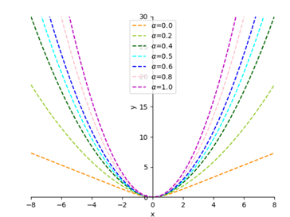
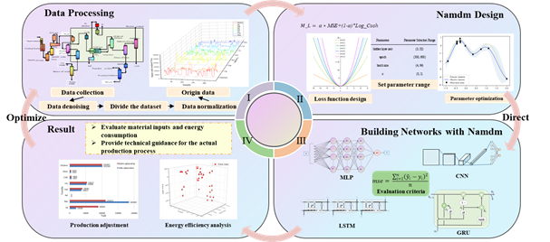

# Namdm

Official implementation of the neural architecture search framework presented in:  **"Novel Neural Network Automation Design Method for Energy Saving and Carbon Emission Reducing of Petrochemical Production Processes"**

## 🚀 Key Features

- **Industrial-Grade NAS** - Automated neural architecture search optimized for petrochemical process modeling
- **Energy-Carbon Dual Optimization** - Integrated energy efficiency and carbon footprint evaluation metrics
- **Production-Ready** - Validated on real-world ethylene cracking furnace data


## 📜AlphaMixLoss

The program known as "run.py" is responsible for implementing the alphaMixLoss, a novel hybrid loss function that was proposed in the aforementioned paper. The shape of the alphaMixLoss loss function is determined by the hyperparameter α, and the value of the hyperparameter α can be determined by the Bayesian optimization algorithm. By learning the hyperparameter α, the strength of the penalty for outliers is balanced against the performance degradation caused by outliers being amplified (especially outliers larger than one).



<center>
    Fig.1 The loss function of the alphaMixLoss
</center>


## 🔖Namdm

 The main steps of the Namdm proposed are as follows.

+ Step 1: Collect the actual production dataset and categorize it into training set and test set as input to the neural network.

+ Step 2: Construct the loss function MixLoss as shown in Equation that can balance the penalty strength of outliers and the performance degradation problem of the Namdm. Meanwhile, the number of hidden layer nodes, the number of iterations, the batch size and the parameter α in the αMixLoss loss function are optimized to achieve the global optimum of the Namdm. 
  $$
  \alpha Mix Loss = \alpha \cdot \mathrm{MSE} + (1 - \alpha) \cdot \mathrm{Log\_Cosh}
  $$

+ Step 3: Apply the Namdm method for optimization of different neural networks and compare it with existing optimization methods. The evaluation criteria are based on MSE and time to verify the superiority of the automatic modeling optimization method.  

+ Step 4: The results are evaluated and analyzed to provide technical guidance for the actual production process.



<center>
    Fig.2 The process of the Namdm
</center>
## 📊 Benchmark Performance


<center>
    Fig.3 Performance(MSE, MAE, MAPE, RMSE, R2) of baseline models and different optimization Methods in the Ethylene production process
</center>


## 📋 Requirements

```bash
# Core dependencies
conda create -n namdm python=3.8
conda install pytorch==1.12.1 torchvision==0.13.1 -c pytorch
pip install -r requirements.txt
```

## 🧪 run

```bash
python run.py
```

## 🤝 Contributing

We welcome contributions focusing on:

+ Industrial process modeling improvements

+ Low-carbon computing optimizations

+ Distributed NAS implementations

This project is part of the Petrochemical Industry 4.0 Research Initiative at **Engineering Research Center of Intelligent PSE**

