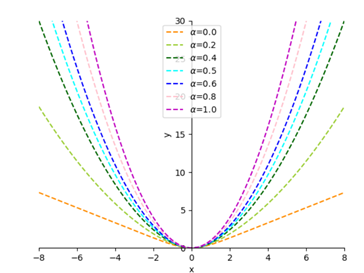
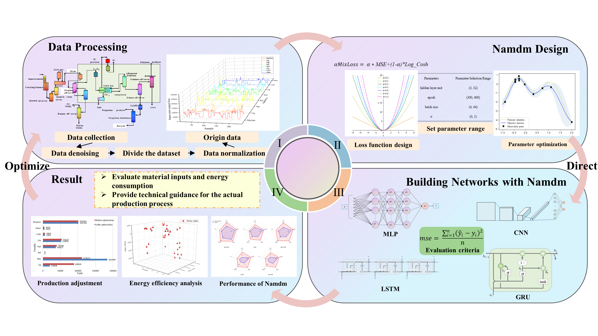
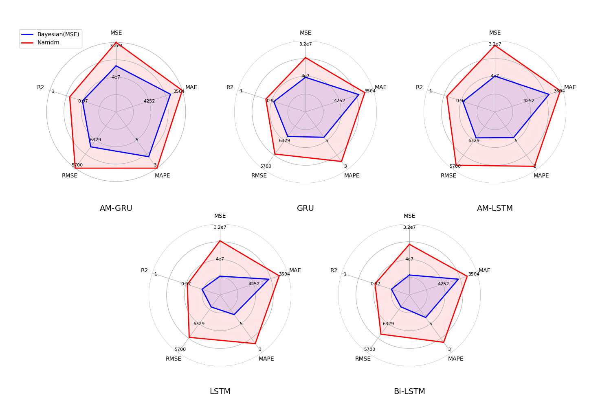

# Namdm

Official implementation of the Namdm

## 🚀 Key Features

- **Industrial-Grade NAS** - Automated neural architecture search optimized for petrochemical process modeling
- **Energy-Carbon Dual Optimization** - Integrated energy efficiency and carbon footprint evaluation metrics
- **Production-Ready** - Validated on real-world ethylene cracking furnace data


## 📜AlphaMixLoss

The script named "run.py" is tasked with implementing the alphaMixLoss, a brand - new hybrid loss function put forward in the previously mentioned paper. The form of the alphaMixLoss loss function is governed by the hyperparameter α, and the value of this hyperparameter α can be ascertained via the Bayesian optimization algorithm. Through the learning process of the hyperparameter α, a balance is struck between the penalty intensity for outliers and the performance decline that results from the amplification of outliers (specifically, outliers greater than one).



<center>
    Fig.1 The loss function of the alphaMixLoss
</center>


## 🔖Namdm

The proposed Namdm follows these principal steps:
Step 1: Gather the real - world production dataset. Then, classify it into a training set and a test set, which will serve as the input for the neural network.
Step 2: Formulate the loss function MixLoss as presented in the following equation. This function is designed to strike a balance between the penalty intensity for outliers and the performance deterioration issue of the Namdm. Additionally, optimize the number of hidden - layer nodes, the iteration count, the batch size, and the parameter α in the αMixLoss loss function. The aim is to reach the global optimum of the Namdm.
αMixLoss=α⋅MSE+(1−α)⋅Log_Cosh
Step 3: Employ the Namdm approach to optimize various neural networks. Subsequently, compare it with pre - existing optimization techniques. The evaluation is carried out using Mean Squared Error (MSE) and time as criteria, with the goal of validating the superiority of this automatic - modeling optimization method.
Step 4: Evaluate and analyze the outcomes. The insights obtained will offer technical direction for the actual production process.



<center>
    Fig.2 The process of the Namdm
</center>


## 📊 Benchmark Performance



<center>
    Fig.3 Performance(MSE, MAE, MAPE, RMSE, R2) of baseline models and different optimization Methods in the Ethylene production process
</center>


## 📋 Requirements

```bash
# Core dependencies
conda create -n namdm python=3.8
conda install pytorch==1.12.1 torchvision==0.13.1 -c pytorch
pip install -r requirements.txt
```

## 🏭 LlamaFactory Integration

Namdm now includes **LlamaFactory** - a unified model factory pattern for creating and training different neural network architectures.

### Key Features

- **Unified Model Creation**: Create any model architecture with a simple factory interface
- **Configuration-Based Training**: Use JSON configs for reproducible experiments
- **Model Comparison**: Easily compare different architectures
- **Extensible Design**: Register custom models easily

### Quick Start with LlamaFactory

```python
from llamafactory import LlamaFactory, ModelFactory

# List available models
factory = LlamaFactory()
print(factory.list_available_models())
# Output: ['amgru', 'amlstm', 'bilstm', 'gru', 'lstm']

# Create a model
model = factory.create_model('amgru', input_dim=10, hidden_dim=32)

# Or use ModelFactory directly
model = ModelFactory.create_model('lstm', input_dim=10, hidden_dim=16)
```

### Training with LlamaFactory

```bash
# Train with command line arguments
python train_llamafactory.py --model amgru --input_dim 10 --hidden_dim 32

# Train with configuration file
python train_llamafactory.py --config config_example.json

# List available models
python train_llamafactory.py --list_models
```

### Integration with Existing Pipeline

```bash
# Train using LlamaFactory with Bayesian optimization
python run_llamafactory.py --model lstm --file_path yixi.csv

# Compare all models
python run_llamafactory.py --compare --init_points 3 --n_iter 5
```

### Configuration Example

```json
{
  "model_name": "amgru",
  "model_config": {
    "input_dim": 10,
    "hidden_dim": 32
  },
  "training_config": {
    "epochs": 500,
    "batch_size": 32,
    "learning_rate": 0.0005
  }
}
```

See `config_example.json` for a complete configuration template.

## 🧪 run

```bash
# Original training script
python run.py

# With LlamaFactory integration
python run_llamafactory.py --model amgru
```

## 🤝 Contributing

We welcome contributions focusing on:

+ Industrial process modeling improvements

+ Low-carbon computing optimizations

+ Distributed NAS implementations

This project is part of the Petrochemical Industry 4.0 Research Initiative at **Engineering Research Center of Intelligent PSE**

